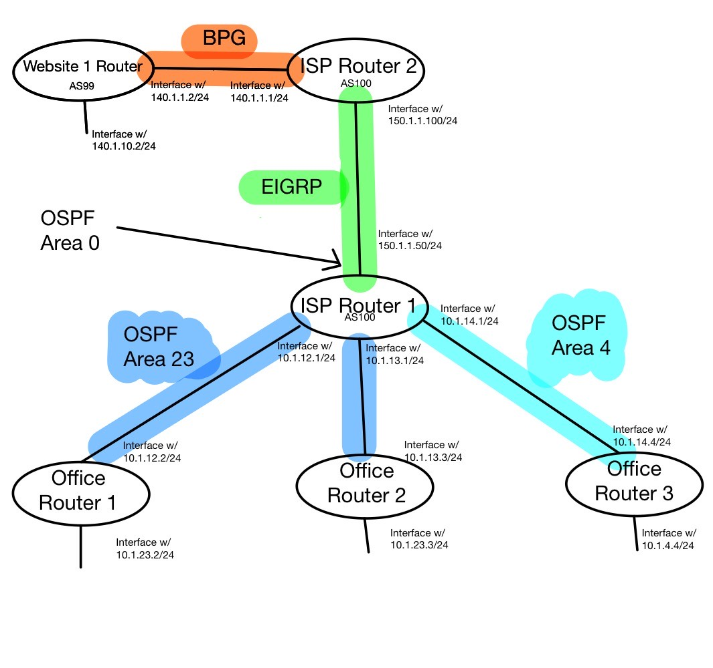

# EIGRP Example
## ISP Router 1
- In Cisco IOS:  
`enable`  
`conf t`  
`router eigrp 100`  
`network  150.1.1.0 0.0.0.255`  
- Now exit the EIGRP config in order to set up the interface, also in IOS
`interface gigabitEthernet0/2`  
`ip address 150.1.1.50 255.255.255.0`  
- Manually turn on interface under the "config" tab

## ISP Router 2
- In Cisco IOS:  
`enable`   
`conf t`  
`router eigrp 100`  
`network 150.1.1.0 0.0.0.255`  
	 - If you mess up this step, just run the same command but with `no` at the beginning

- Same as before, we now need to exit the eigrp config in order to assign an IP address to the physical port, also in IOS:  
`interface gigabitEthernet0/0`  
`ip address 150.1.1.100 255.255.255.0`  
- Manually turn on interface (under config tab) 

## Checking Our Work
- On ISP Router 1 in IOS:  
`show running-config`  
`show ip eigrp neighbors`  
- On ISP Router 2 IOS:
`show ip eigrp neighbors`  

## Saving Our Work
- On both routers:  
`enable`  
`copy running-config startup-config`  

<!---
# Setting Up Server 2
- On Website 2 Router in IOS:  
`enable`  
`conf t`  
`ip address 200.1.1.10 255.255.255.0`  
- On the Website 2 Server under services:
	- Enable HTTPS
- Same server but under Config -> Global -> Settings
	- Set the Gateway/DNS IPv4 to static with the Default Gateway IP address as 200.1.1.10
- Same server but now under Config -> Interface -> FastEthernet0
	- Set the IP configuration to static with IPv4 address 200.1.1.20
	- The subnet mask should autofill to 255.255.255.0. This is what we want!

# What's Next?
- At this point we might be tempted to set up a desktop | laptop | workstation ASAP so we can test connection to the website 
	- This can be accomplished using the same commands and approach we've used thus far. Meaning it's not a difficult-enough of a task for the purpose of this exercise. We will therefore hold off on this step! 
-->
<!---
- The next step will be to set up a VLAN between offices 1 and 3. The decision for this is not completely arbitrary. Notice how these two offices have similar types of computers on their network: desktops, workstations, and laptops. For the purposes of our scenario, let these be geographically separated offices which need to act as one network!
- Before we can worry about VLAN configurations, which is something we'll accomplish on the switches, we must first set up the intermediary routers.
-->
# OSPF Example
## Office 1 Router
- On Office 1 Router:  
`enable`  
`conf t`  
`interface gigabitEthernet 0/1` (interface in non-backbone area)   
`ip address 10.1.23.2 255.255.255.0`  
`exit`  
`interface gigabitEthernet 0/0` (interface in backbone area)  
`ip address 10.1.12.2 255.255.255.0`  
`exit`  
`router ospf 1` 
	- We now get the following error: `OSPF process 1 cannot start. There must be at least one "up" IP interface`
	- We can fix this by going into the config GUI panel and toggling on our interfaces
`exit`  
`router ospf 1`  
`network 10.0.0.0 0.255.255.255 area 23`  
`router-id 2.2.2.2`  
	- We get a message saying `Reload or use "clear ip ospf process" command, for this to take effect`
	- Let's exit to the user exec terminal, do a `copy running-config startup-config` and then `reload`
## Office 2 Router
- In IOS:
`enable`  
`configure terminal`  
`interface gigabitEthernet 0/0`  
`ip address 10.1.23.3 255.255.255.0`  
`exit`  
`interface gigabitEthernet0/1`  
`ip address 10.1.13.3 255.255.255.0`  
`exit`  
`interface loopback 0` (We do this to set the Router ID) 
`ip address 3.3.3.3 255.255.255.0`  
`exit`  
`router ospf 1`  
`network 10.0.0.0 0.255.255.255 area 23`  
`exit`  
`exit`  
`copy running-config startup-config`  
- After saving, once again enable both gigabit ethernet interfaces in the config GUI  

## Office 3 Router
`enable`  
`conf t`  
`interface gigabitEthernet0/0` (internal interface)  
`ip address 10.1.4.4 255.255.255.0`  
`exit`  
`interface gigabitEthernet 0/1`  
`ip address 10.1.14.4 255.255.255.0`  
`exit`  
- Now enable the interfaces in the GUI like before 
- Next, we set up ospf on this router, back in IOS again
`exit`  
`router ospf 1`  
`network 10.0.0.0 0.255.255.255 area 4`  
`passive-interface gigabitEthernet0/0` (internal interface)  
`exit`  
`exit`  
`copy running-config startup-config`  

## ISP Router 1
- In the GUI, let's first make sure all the gigabitEthernet interfaces are on
- Now in IOS, we will assign IP addresses to the interfaces:
`enable`  
`config t`  
`interface gigabitEthernet0/1` (area 23 network)  
`ip address 10.1.12.1 255.255.255.0`  
`exit`  
`interface gigabitEthernet0/0` (area 23 network)  
`ip address 10.1.13.1 255.255.255.0`  
`exit`  
`interface fastEthernet0/3/0`  
`ip address 10.1.14.1 255.255.255.0`  
	- But wait, we have an error! We can't run the ip command!
	- Turns out it's a switchport. Long story short, it's a port on a router that is acting like a port on a switch. We can't assign an IP to it so let's remove the cable, power off the device, and install a gigabit port to use instead. - Press delete and select the cable connecting ISP router 1 with Office 3 Router
- Open ISP Router 1 again and select the physical GUI tab
	- Power off the switch
	- Remove all of the HWIC-4ESW modules.
	- Add an HWIC-2T serial terminal module
	- Apply WIC covers to the blank spots 
- On Office 3 Router, we must now also add an HWIC-2T panel
	- Because we removed the gigabit interface, we must redo the commands for the external interface on Office 3 Router
- On Office 3 Router, we run:
`enable`  
`conf t`  
`interface serial 0/2/0`  
`ip address 10.1.14.4 255.255.255.0`  
	- We now get an error that it overlaps with GigabitEthernet0/1
	- Let's config that interface and use `no`
- Back on the serial connection, let's try again:
`ip address 10.1.14.4 255.255.255.0`  
`exit`  
`exit`  
`copy running-config startup-config`  
- Now we finally get to go back to ISP Router 1
- Reconnect the ISP Router 1 and the Office 3 Router
- Now let's give the serial interface an address
`enable`  
`conf t`  
`interface serial 0/0/0`  
`ip address 10.1.14.1 255.255.255.0`  
`exit`  
- Assigning networks to OSPF areas
`router ospf 1`  
`network 150.1.1.50 0.0.0.0 area 0` (Our backbone interface)  
`network 10.1.12.1 0.0.0.0 area 23`  
`network 10.1.13.1 0.0.0.0 area 23`  
`network 10.1.14.1 0.0.0.0 area 4`  
`router-id 1.1.1.1`	 
`passive-interface gigabitEthernet0/2`  
`exit`  
`exit` 
`copy running-config startup-config`  
`reload`  
## cHECking Our Work
# BGP Example
## ISP Router 2
`enable`  
`conf t`  
`interface gigabitEthernet 0/1`  
`ip address 140.1.1.1 255.255.255.0`  
`no shut`  
`exit`  
<!--`interface gigabitEthernet 0/2`  
`ip address 160.1.1.1 255.255.255.0`  
`no shut`  
`exit`  
`router bgp 100`  
`network 140.1.1.0 mask 255.255.255.0`  
`network 160.1.1.0 mask 255.255.255.0`  
`exit`   -->
`router bgp 100`  
`neighbor 140.1.1.2 remote-as 99`  
`exit`  
`exit`  
`copy running-config startup-config`  

## Website 1 Router
`enable` 
`conf t`  
`interface gigabitEthernet0/1`  
`ip address 140.1.1.2 255.255.255.0`  
`no shut`
`exit`
`interface gigabitEthernet0/1`  
`ip address 140.1.10.2 255.255.255.0`  
`no shut`  
`exit`  
`router bgp 99`  
`neighbor 140.1.1.1 remote-as 100`  
`exit`  
`exit`  
`copy running-config startup-config`  
<!--
## Website 2 Router
`enable`  
`conf t`  
`interface gigabitEthernet0/1`  
`ip address 160.1.1.2 255.255.255.0`  
`ip address 160.1.10.2 255.255.255.0`  
`exit`  
`exit`  
`copy running-config startup-config`   -->
## Checking Our Work
- On both routers, in exec mode, run:
`show ip bgp neighbors`  
